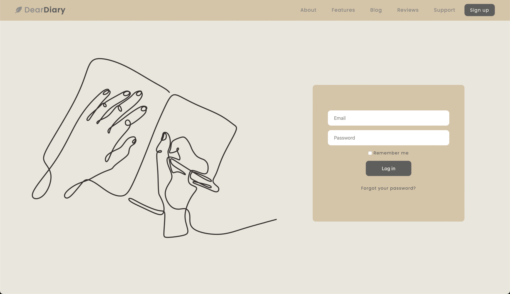
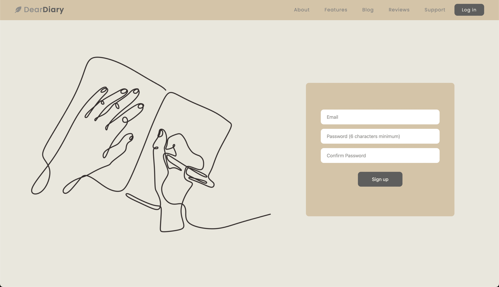
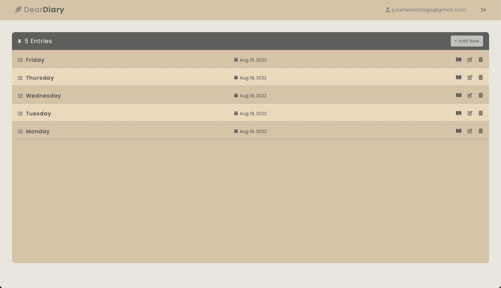
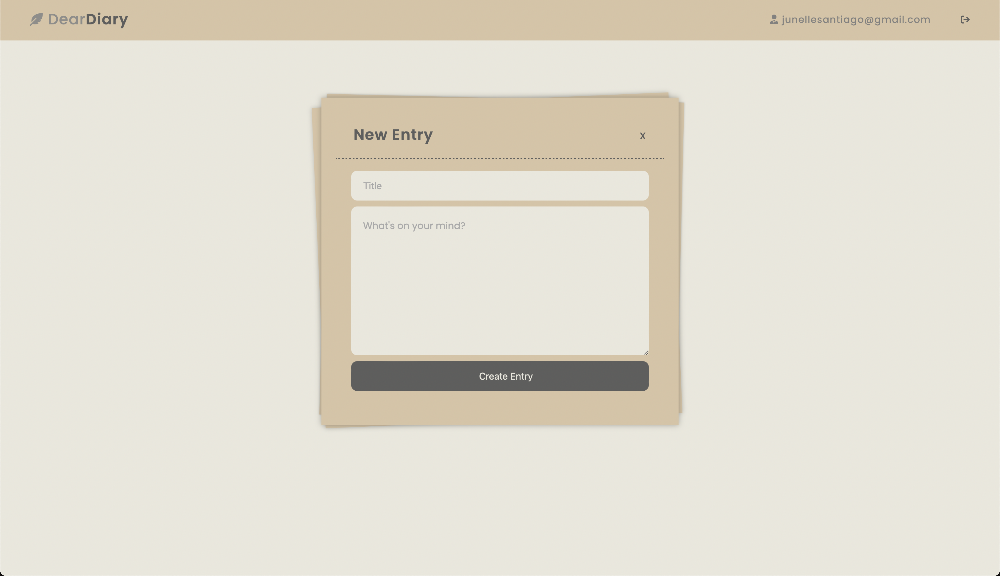

### ✨ [Blog App (Click to see live version)](http://dear-diary-blog-app.herokuapp.com)

>> ###### *Ruby on Rails application allowing users to publish their thoughts.*
>> - Installed devise gem so users can log in and sign up using email and password.
>> - Used devise helper for user authentication to limit users’ access unless logged in.
>> - Utilized scaffold to auto generate a set of model, views, and controller for entries table and create a full CRUD web interface so users can create, view, edit, and delete an entry.
>> - Used the count method to show how many entries the user has made.
>> - Used the created at column to add a date beside the entry title so users can see when the entry was created.
>> - Sorted the entries using order method so users can see the recent entry at the top.
>> - Utilized devise test helpers to do a system test to simulate user interaction within the application.

 

>> ###### Sources:
>> - Heartcombo's [Devise Tutorial](https://github.com/heartcombo/devise)
>> - Line Art Images: [PNG Tree](https://pngtree.com)
>> - Ruby on Rails's [Guides](https://guides.rubyonrails.org/v6.1/)
